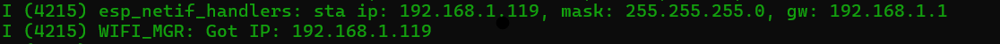

# ESP-Scope (ESP32 WROOM-32D Port)

A **stable, plug-and-play** port of [MatAtBread’s ESP-Scope](https://github.com/MatAtBread/esp-scope) for the **classic ESP32 (WROOM-32D)**.  
Designed to run on most 30/38-pin ESP32 dev boards without crashes, black screens, or Wi-Fi lockups.

This fork adapts the original ESP32-C6 (RISC-V) design to **Xtensa-based ESP32** hardware by fixing driver assumptions, memory usage, and network behavior that break on WROOM boards.
<br><br>

<br>
## ⚡ What was fixed
* **Board Init:** Added `esp32_wroom_32d.h` and fixed the broken struct braces that killed the build.
* **ADC Driver:** Forced **Type 1 DMA** and locked the floor to **20kHz**. No more hardware-level panics.
* **Memory:** Moved 4KB buffers to **Static RAM** and bumped the task stack to **6KB**.
* **Network:** Enabled `lru_purge` (socket recycling) and killed the "hello" handshake so the stream actually starts.
* **Stability:** Added frame-skipping so the Wi-Fi stack doesn't choke on raw data.
<br><br>
## 🚀 How to build
You **must** clean the build first or the web files won't load.

```bash
idf.py set-target esp32
idf.py fullclean
idf.py build flash monitor
```

1. Connect to **ESP-Scope** Wi-Fi AP
2. Navigate to **192.168.4.1** to access the scope

**Optional:** Configure your own Wi-Fi network through the interface. The device will restart and the new IP will be shown in the serial monitor.

<br><br>
## Pinout
| Function | GPIO | Notes |
|----------|------|-------|
| Signal Input | 36 (VP) | Analog input displayed on scope (0-3.3V max) |
| Test Signal | 18 | 100 Hz test waveform for calibration |
| Status LED | 2 | Streaming indicator |
| Factory Reset | 0 | Hold BOOT button 3s |

---
## Troubleshooting

- **White screen:** Run `idf.py fullclean` and rebuild
- **No waveform:** Verify 2.4 GHz network connection
- **Stuttering:** Intentional frame skipping for stability
- **Boot loops:** Check power supply (500mA minimum)
<br><br>
## Important Notes

- Sampling capped at 20 kHz (hardware limitation)
- Frame rate is half of capture rate by design
- **Do not reduce task stack below 6KB**
- For ESP32-C3/C6/S3, use the original project for better performance


<br><br>
## Credits

**Original:** [MatAtBread](https://github.com/MatAtBread/esp-scope) – UI, architecture, and concept  
**License:** MIT

This is a hardware-specific adaptation for Xtensa-based ESP32 modules.
